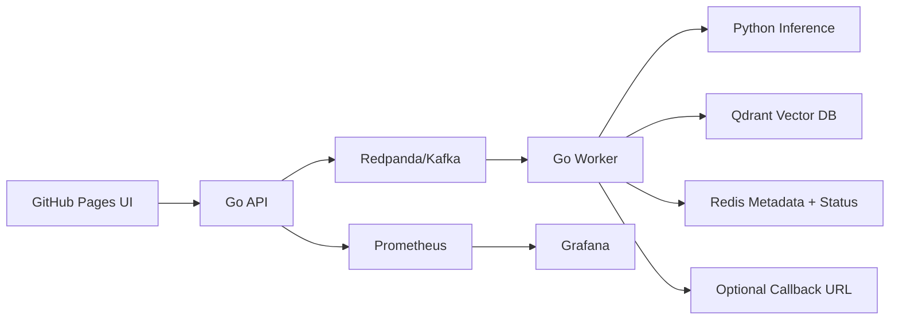

# Visual Identity KYC System

A full-stack, async-first KYC / Re-KYC identity resolution project.

## What this project proves

- Live photograph + demographics enrollment
- 512D face embedding pipeline
- 768D name embedding pipeline
- Duplicate enrollment detection
- Re-KYC verification
- Secure demographic hashing
- Kafka/Redpanda async processing
- Go API + Go worker + Python inference microservices
- Qdrant vector search + Redis metadata/status store
- Kubernetes + Helm deployment
- Grafana/Prometheus observability
- GitHub Pages recruiter UI
- Cloudflare Tunnel public demo path

## Project structure

```text
api/                  Go API and worker source code
inference/            Python embedding/liveness service using uv + .venv
frontend/             Static GitHub Pages UI, no Node dependency required
helm/visual-kyc/      Helm chart for local kind/GKE-style deployment
monitoring/           Prometheus/Grafana config
scripts/              Windows helper scripts for Docker, Kubernetes, UI, Cloudflare
docs/                 Architecture and delivery notes
.github/workflows/    GitHub Pages frontend deployment workflow
working.md            Full noob-friendly runbook
```

## Architecture



## Quick local demo

```powershell
docker compose up -d --build
curl.exe http://localhost:8080/health
```

Open frontend locally:

```powershell
powershell -ExecutionPolicy Bypass -File .\scripts\open_frontend_local_windows.ps1
```

## Kubernetes local demo

```powershell
kubectl config use-context kind-visual-kyc
helm upgrade --install visual-kyc .\helm\visual-kyc
powershell -ExecutionPolicy Bypass -File .\scripts\k8s_create_topics_windows.ps1
kubectl port-forward svc/api 8080:8080
```

## Public demo flow

1. Deploy frontend with GitHub Pages.
2. Run backend locally on Kubernetes.
3. Expose backend with Cloudflare Tunnel.
4. Paste Cloudflare API URL into the frontend.

Full commands are in `working.md`.
